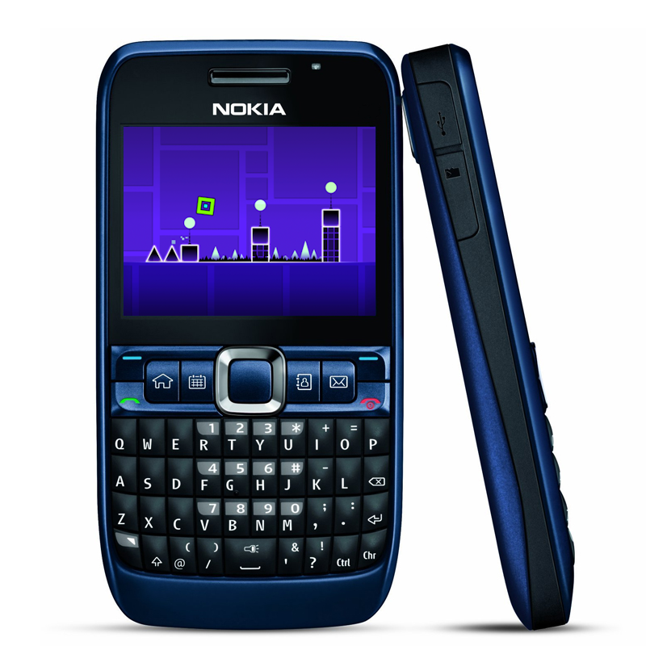

# geometryj2me

# About
Geometry Dash J2ME is the demake of Geometry Dash for Java Phones.

# Credits
## Dev-Team
|Contributors|Role|
|---|---|
|[thesharkguy](https://github.com/SharkZubat)|dev, code, lvls, music, testing and bugfixes|
|virtualinsane_|music|
|[Soteris24](https://github.com/Soteris24)|dev, music|
|[okujassu](https://github.com/okujassu)|music|
|[emelchenkoe](https://github.com/emelchenkoe)|code(?), graphics|

To see the to-do list, [click here.](https://github.com/SharkZubat/geometryj2me/blob/main/more/todolist.md)

# Downloads
[~~Latest Build~~ (not yet)]() | [Nightly Build](https://github.com/SharkZubat/geometryj2me/raw/refs/heads/main/.eclipseme.tmp/emulation/GeometryJ2ME.jar)
